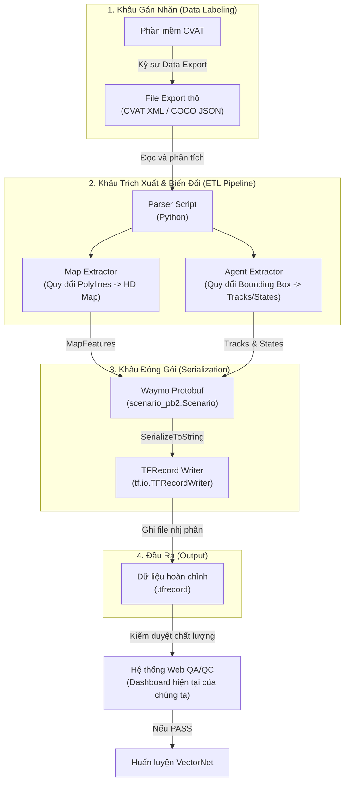

# Workflow: Chuyển đổi dữ liệu từ CVAT sang Waymo TFRecord

Tài liệu này mô tả kiến trúc (Architecture) và luồng dữ liệu (Data Pipeline) để biến đổi kết quả gán nhãn thô từ phần mềm CVAT thành định dạng nhị phân `.tfrecord` chuẩn của Waymo, sẵn sàng phục vụ cho mô hình VectorNet.

## Sơ đồ Kiến trúc (Data Engineering Pipeline)

## Chi tiết các bước thực hiện (Workflow)

### Bước 1: Gán nhãn và Xuất dữ liệu (CVAT)
- Đội ngũ Data Annotator (người gán nhãn) thực hiện vẽ các đa giác/đường gấp khúc (Polylines) cho vạch kẻ đường, đèn giao thông. 
- Vẽ Bounding Box và gán Tracking ID cho các xe cộ di chuyển qua từng khung hình (Frame).
- Dữ liệu cuối cùng được tải xuống dưới định dạng **CVAT for Video (XML)** hoặc **COCO (JSON)**. Định dạng này dễ đọc nhưng dung lượng cực lớn và AI không hiểu được cấu trúc Vector.

### Bước 2: Trích xuất & Biến đổi (ETL - Extract, Transform, Load)
Một đoạn script Python (ví dụ: `cvat_to_waymo_converter.py`) sẽ được chạy để làm các nhiệm vụ:
- **Map Extractor:** Tìm tất cả các `Polylines` đại diện cho đường, làm mịn nội suy tọa độ (Interpolation), gán ID và tạo thành một mạng lưới đồ thị (Graph).
- **Agent Extractor:** Gom nhóm tọa độ của các `Bounding Box` có cùng Tracking ID (ví dụ xe ID #1) qua các Frame (Frame 1, Frame 2, ...). Dựa vào độ lệch tọa độ giữa các Frame và thời gian (Delta T), script sẽ dùng đạo hàm tính ra được `Vận tốc (Velocity)` và `Gia tốc (Acceleration)` thực tế.

### Bước 3: Đóng gói Protobuf
- Dữ liệu ở Bước 2 đang nằm trong RAM máy tính (dưới dạng List, Dictionary của Python). 
- Hệ thống sẽ gọi bộ thư viện `waymo_open_dataset.protos.scenario_pb2` do Google Waymo phát hành.
- Nó khởi tạo Object `Scenario()`, rồi nhồi các thông tin HD Map và Agent Dynamics vào các Field chuẩn của Protobuf. 

### Bước 4: Serialize và nén TFRecord
- Object Protobuf sẽ được gọi hàm `.SerializeToString()` để biến toàn bộ cấu trúc phức tạp đó thành một chuỗi byte (Nhị phân) duy nhất.
- Hàm `tf.io.TFRecordWriter` của TensorFlow sẽ ghi chuỗi byte này xuống ổ cứng với định dạng `.tfrecord`. Quá trình này giúp nén dữ liệu cực mạnh (có thể giảm hàng chục lần so với file JSON gốc) và tối ưu hóa tốc độ đọc (Read-speed) vào card đồ họa (GPU) khi huấn luyện AI.

---
**Kết nối với hệ thống hiện tại:** File `.tfrecord` được sinh ra ở Bước 4 chính là file dữ liệu thô (300MB) mà hệ thống Web Dashboard QA/QC của chúng ta vừa đọc để phát hiện ra lỗi vận tốc 200km/h ở các luồng xử lý trước đó.
