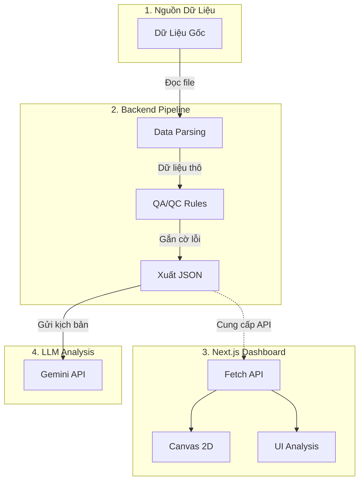

# Kiến trúc Hệ thống VectorNet QA/QC

Dưới đây là sơ đồ luồng hoạt động (Workflow) của hệ thống kiểm duyệt chất lượng dữ liệu bản đồ Vector, từ bước xử lý dữ liệu thô cho đến khi hiển thị lên giao diện người dùng.

## Giải thích Luồng thực hiện (Workflow)

Hệ thống hoạt động theo **4 giai đoạn chính**:

1. **Giai đoạn Thu thập (Data Source):** 
   Hệ thống bắt đầu bằng việc nhận các file dữ liệu khổng lồ định dạng `.tfrecord` từ bộ dataset nguồn của Waymo.

2. **Giai đoạn Xử lý & Kiểm định (Backend Pipeline):**
   - Script Python (`backend_pipeline.py`) đóng vai trò làm "Bộ Lọc". Nó giải nén các lớp dữ liệu phức tạp thành những đối tượng dễ hiểu (Vạch kẻ đường, đèn giao thông, quỹ đạo xe).
   - **Rule-based QA/QC** ngay lập tức nhảy vào kiểm tra các quy tắc cứng: *Xe có chạy nhanh bất thường không? Đèn xanh có đột ngột chuyển đỏ không?* Nếu có, nó gắn cờ lỗi (Flags).
   - Mọi kết quả được đóng gói gọi gọn vào một file nhẹ nhàng: `frontend_data.json`.

3. **Giai đoạn Hiển thị (Frontend Dashboard):**
   - Website Next.js độc lập sẽ quét file JSON này. 
   - Nó dùng Engine `Canvas 2D` để tái tạo lại toàn bộ kịch bản giao thông để anh có thể "nhìn thấy" lỗi bằng mắt thường, thay vì đọc code khô khan. Đồng thời, hiển thị biên bản báo cáo (Analysis Report).

4. **Giai đoạn Tư duy (AI Agent):**
   - Trong quá trình triển khai thực tế, file JSON này có thể được bơm thẳng vào prompt của mô hình ngôn ngữ (Gemini). AI Agent sẽ đọc các lỗi rule-based và tự viết ra một báo cáo phân tích chuyên sâu cho kỹ sư gán nhãn, tạo thành một hệ thống duyệt lỗi 100% tự động.
