# Issue Guideline — chỗ mơ hồ / mâu thuẫn trong guideline Traffic Sign

Rà soát lần 2, ngày 2026-09-26 (Phong). So **hai bản guideline** đang cùng tồn tại:

- **[V1.2]** `guideline/LABELING_GUIDELINE_V1.md` — đang nằm trong repo.
- **[H]** bản guideline Hoàng gửi nhóm lúc 11:40 ngày 26/09, gồm các mục: 1. Công cụ & quy cách vẽ box ·
  2. Danh mục nhãn · 3. Thuộc tính. Bản này chưa có trong repo.

## Cách đọc file này

**Vì sao cần file này.** Theo yêu cầu của thầy (Hoàng ghi lại lúc 11:12): nhóm tự chọn golden set, đưa guideline v1
cho người khác làm, nhận feedback, rồi ra v2 có thêm edge case và ví dụ. File này là phần feedback cho guideline trước
khi nhóm ra v2.

**Chỉ ghi điều kiểm được.** Mỗi dẫn chứng lấy từ một trong các nguồn sau:

1. Nguyên văn V1.2 hoặc [H].
2. 3 ảnh trong `data/raw/` (`00054`, `00177`, `00366`), toạ độ đo trên ảnh gốc.
3. Nhóm biển theo GTSDB, lấy từ GT tham chiếu của lab Day 9 (`mini-task/refs/traffic_sign.zip`) và từ
   `lec/scripts/_common.py` (`GTSDB_FAMILY`) của bài giảng. Hai nguồn này khớp nhau.
4. Mã nguồn `backend/cvat_parser.py`.
5. Bài gán của NguyenHuuDung (nhánh `Tuan`, commit `cc7844c`).

Chỗ nào chưa kiểm được thì ghi rõ là **cần nhóm quyết**.

**Golden set do nhóm chọn.** Vì vậy phần lớn issue là chuyện "hai người làm đúng chữ trong guideline mà vẫn ra hai
kết quả khác nhau", không phải chuyện "không khớp GTSDB". Riêng những chỗ V1.2 tự nhận là "chuẩn GTSDB" thì so với
GTSDB.

**Ảnh minh hoạ.** Cắt từ `data/raw`, lưu trong `guideline/issue_images/`. Ảnh nhỏ được phóng to kiểu nearest, tức
giữ nguyên điểm ảnh gốc, không làm nét thêm. Quy ước màu khung:

- 🟩 xanh lá: box trong GT tham chiếu GTSDB.
- 🟥 đỏ: box trong bài NguyenHuuDung.
- 🟨 vàng: vật thể cần chú ý mà GT tham chiếu không có.

**Mức độ.**

- **critical**: hai bản guideline nói ngược nhau, hoặc làm đúng chữ vẫn bị script chấm sai.
- **major**: hai người hợp lý sẽ làm khác nhau.
- **minor**: câu chữ hoặc trình bày.

| ID | Vấn đề | V1.2 | [H] | Mức | Trạng thái sau đối chiếu |
|---|---|---|---|---|---|
| G-18 | Hai bản guideline song song, không rõ bản nào chính thức | có | có | critical | **mới** — cần chốt trước tiên |
| G-17 | Biển *cấm đi ngược chiều / no entry*: V1.2 bắt `other`, [H] xếp vào `prohibitory` | other | prohibitory | critical | **mới** |
| G-01 | Bảng mã mục 4 sai nhóm biển so với GTSDB (27–31, 32, 41, 42; thiếu 6, 16) | sai | không có bảng | critical | còn (nếu giữ V1.2) |
| G-02 | Phạm vi: chỉ 43 lớp GTSDB hay mọi biển? | "chuẩn GTSDB" | mọi biển (có biển chỉ dẫn, cấm dừng/đỗ) | critical | [H] đã chọn hướng, V1.2 chưa; golden set phải theo |
| G-19 | Biển chỉ dẫn nhiều chi tiết: một box hay nhiều box, label / class gì | không nói | "biển chỉ dẫn → other", không nói box | major | **mới** (có ảnh) |
| G-20 | Thiếu ảnh ví dụ; biển xanh vuông / chữ nhật có mũi tên: `mandatory` hay `other` | theo hình dạng | theo ý nghĩa | major | **mới** (có ảnh) |
| G-04 | `sign_class` tự gõ, hai bản dùng hai kiểu tên | `speed_limit_50` | `speed limit 50` | critical | còn — script so khớp tuyệt đối |
| G-16 | Giá trị mặc định (label đầu tiên, `readable = yes`) tạo lỗi im lặng | không nói | ghi rõ "mặc định yes" | major | còn — thấy trong bài thật |
| G-07 | `readable`: `no` và `uncertain` khác nhau thế nào | 3 giá trị, không định nghĩa | `yes` có định nghĩa, `no` và `uncertain` gộp một | major | một phần |
| G-05 | Box khi bị che: bao cả phần bị che hay chỉ phần nhìn thấy | bao trọn | không nói | major | còn |
| G-06 | Ngưỡng kích thước tối thiểu | 15×15 px, chưa rõ đo thế nào | không có | major | còn |
| G-09 | Không có đường escalate khi không chắc | không | không | major | còn |
| G-03 | Biển phụ: `sign_class` ghi gì | `other`, không nói class | `other`, không nói class | major | hai bản khớp nhau về label; hạ từ critical |
| G-08 | `relevant_to_ego` khi ảnh không cho biết hướng đi | không tiêu chí | có tiêu chí | minor | một phần — hạ từ major |
| G-10 | Box "sát"; box GT GTSDB không khít | liệt kê phần loại trừ | "khít sát viền ngoài" | major | guideline đã rõ ở [H]; golden set phải vẽ lại cho khít |
| G-11 | Quá tối / mờ: có gán hay không | không có ngưỡng | chỉ nói chọn `readable` | major | còn (có ảnh) |
| G-12 | Danh sách loại trừ; mặt sau biển STOP, cọc tiêu | có, còn mơ hồ | không có | minor | còn (có ảnh) |
| G-13 | `danger` mô tả "nền vàng" | có | không mô tả màu | minor | chỉ còn ở V1.2 |
| G-14 | Ảnh không có biển thì nộp gì | không | không | minor | còn |
| G-15 | Phiên bản và lịch sử thay đổi | V1 / V1.2 lẫn | không có số phiên bản | minor | gộp vào G-18 |

---

## G-18 · Hai bản guideline song song — **critical** (mới)

**Hiện trạng:**

- V1.2 nằm trong repo. Đó là bản `backend/cvat_parser.py` dẫn chiếu: mọi `hint` đều ghi "Guideline V1.2 - Phan …".
- [H] được gửi qua chat, không có số phiên bản. Nội dung khác V1.2 ở nhiều điểm, xem G-17, G-02, G-04, G-07.
- Chưa có chỗ nào ghi bản nào đang được dán vào Guide của task CVAT cho người gán.

**Vì sao là critical:** quy trình thầy yêu cầu là "v1 → người khác làm → đánh giá → v2". Người gán đọc bản này, script
chấm theo bản kia, thì kết quả đánh giá không nói lên chất lượng guideline.

**Đề xuất:**

1. Chốt **một** bản làm v1 chính thức, đưa vào repo (ví dụ gộp nội dung [H] vào `guideline/LABELING_GUIDELINE_V1.md`).
2. Ghi số phiên bản trong file. Bản đang dán trong Guide của CVAT phải giống hệt bản trong repo.
3. Sửa các `hint` trong `cvat_parser.py` cho khớp số phiên bản đã chốt.

## G-17 · *No entry* / *cấm đi ngược chiều*: hai bản nói ngược nhau — **critical** (mới)

**Nguyên văn:**

- V1.2, mục 5.2: `Biển Cấm vào (tròn đỏ ngang trắng) | no_entry | ~~prohibitory~~ | **other**`.
- [H], mục 2: `prohibitory (Biển cấm / Hạn chế): Ví dụ: Cấm đi ngược chiều, …`

**Dẫn chứng:**

- Biển "tròn đỏ, vạch ngang trắng" chính là biển mà [H] gọi là *cấm đi ngược chiều*.
- GTSDB xếp mã 17 *no entry* vào `other` (GT tham chiếu của lab).
- `cvat_parser.py`, Rule 5, bắt lỗi khi `sign_class = no_entry` mà label là `prohibitory`. Vậy người gán làm đúng theo
  [H] sẽ bị Rule 5 đánh FAIL.

Trong 3 ảnh của `data/raw` không có biển *no entry*. Ảnh dưới lấy từ bộ GTSDB của lab (`GTS17`, gốc `00096.png`,
box theo GT tham chiếu). Đây chính là biển mà [H] gọi là "cấm đi ngược chiều", còn GTSDB xếp vào `other`.

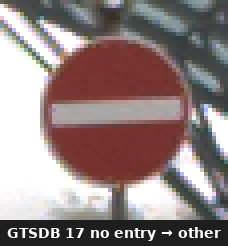

**Đề xuất:** chọn một cách xếp. Nếu theo GTSDB thì sửa ví dụ trong [H], chuyển *cấm đi ngược chiều* sang `other`, và
đưa nó vào danh sách "bẫy" giống V1.2.

## G-01 · Bảng mã V1.2 (mục 4) sai nhóm biển so với GTSDB — **critical**

V1.2 tự nhận "Chuẩn hóa theo GTSDB", nhưng bảng mục 4 lệch GTSDB ở các mã sau:

| Mã | Tên (GTSDB) | Nhóm theo GTSDB | V1.2 ghi |
|---|---|---|---|
| 6 | restriction ends 80 | other | không có trong bảng |
| 16 | no trucks | prohibitory | không có trong bảng |
| 27–31 | pedestrian crossing, school crossing, cycles crossing, snow, animals | **danger** | `end_of_*` → other |
| 32 | restriction ends | **other** | `mandatory_*` |
| 41 | restriction ends (overtaking) | **other** | `mandatory_*` |
| 42 | restriction ends (overtaking (trucks)) | other | gọi là `end_of_all_restrictions` — tên đó là mã **32** |

Tên lớp lấy từ `mini-task/data/traffic_sign/schema.json` của lab. Nhóm biển lấy từ GT tham chiếu của lab (có sẵn các mã
27, 30, 42) và `GTSDB_FAMILY` của bài giảng (có đủ các mã còn lại).

**Dẫn chứng:** `00054` có biển *đi bộ qua đường* (mã 27, box 1113,436 40×38).

- V1.2 → `other`.
- [H] → `danger` (ví dụ "người đi bộ qua đường" nằm trong nhóm danger).
- GTSDB → `danger`.

Nghĩa là V1.2 lệch cả [H] lẫn GTSDB. `cvat_parser.py` cũng chép lỗi này: comment Rule 5 ghi "GTSDB #42 = hết tất cả hạn
chế".

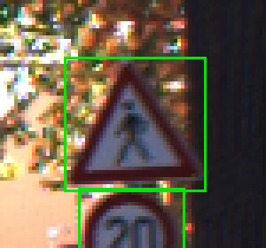

*`00054`: biển đi bộ qua đường (mã 27), tam giác viền đỏ **nền trắng**. GTSDB xếp `danger`, V1.2 xếp `other`.*

**Đề xuất:** nếu giữ bảng mã, thay bằng bảng đủ 43 dòng (mã · tên · nhóm) sinh từ schema của lab. Nếu chọn [H] (không
có bảng mã) thì chuyển issue này thành việc sửa `FAMILY_MAPPING_TRAP` trong `cvat_parser.py`.

## G-02 · Phạm vi gán nhãn — **critical**

**Nguyên văn:**

- V1.2, mục 1: "theo chuẩn GTSDB". Mục 2: `other | Tất cả loại còn lại`.
- [H]: `other: … Biển chỉ dẫn, biển phụ, …` và `prohibitory: … cấm dừng/đỗ`.

**Hiện trạng:** [H] chọn **gán mọi biển**, kể cả biển chỉ dẫn và *cấm dừng/đỗ*, là những biển không thuộc 43 lớp GTSDB
(đã kiểm trong schema của lab). V1.2 vẫn nói "chuẩn GTSDB" mà không nói phải xử lý các biển ngoài 43 lớp ra sao.

**Dẫn chứng:** 3 ảnh có 4 biển chỉ dẫn / thông tin:

- `00054`: biển vàng khoảng (1016,461).
- `00177`: biển chỉ đường lớn (771,297, 117×117).
- `00366`: 2 biển xanh trên cao tốc (659,559 · 692,559).

Bài của NguyenHuuDung đã vẽ cả 4 biển này, tức là làm theo cách hiểu của [H].

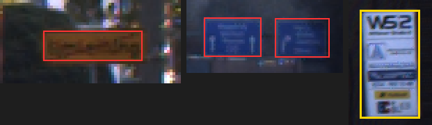

*Từ trái sang:*

1. *`00054` biển vàng có chữ.*
2. *`00366` hai biển xanh trên cao tốc.*
3. *`00054` bảng "W52" gắn tường.*

*Hai ảnh đầu: người gán **đã vẽ** (đỏ), GT tham chiếu không có. Ảnh cuối: chưa ai vẽ. Bảng này có phải "biển thông tin"
theo phạm vi của [H] không? **Cần nhóm quyết.***

Biển chỉ đường lớn ở `00177` có nhiều chi tiết hơn hẳn, nên tách thành issue riêng **G-19**.

**Đề xuất:** chốt theo G-18.

- Nếu theo [H], golden set phải có đủ các biển chỉ dẫn này. GT tham chiếu GTSDB hiện tại **không có**, nên không dùng
  thẳng GT đó làm golden set được.
- Nếu theo GTSDB, ghi một câu: "chỉ gán 43 lớp trong bảng; biển chỉ dẫn, biển thông tin: không gán".

## G-19 · Biển chỉ dẫn quá nhiều chi tiết: vẽ box thế nào? — **major** (mới, theo feedback)

**Hiện trạng:** [H] xếp "biển chỉ dẫn" vào `other`. V1.2 có quy tắc atomic: "mỗi mặt biển = một box". Không bản nào nói
phải làm gì khi **một tấm biển chỉ dẫn chứa nhiều biển và ký hiệu con**.

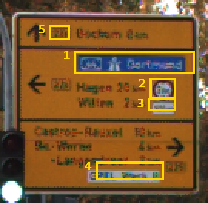

*Biển chỉ đường ở `00177` (vùng 771–888, 297–414, phóng to điểm ảnh gốc). Bên trong có:*

1. *Ô nền xanh ghi "Dortmund" kèm biểu tượng cao tốc.*
2. *Một **biển tròn viền đỏ in sẵn** (khoảng 13×12 px).*
3. *Biển phụ nhỏ ngay dưới biển tròn.*
4. *Tấm nhỏ nền trắng ghi "OPEL Werk II".*
5. *Các ô số hiệu đường (bên trái mỗi dòng chữ).*

**Câu hỏi guideline chưa trả lời:**

- Vẽ **một** box cho cả tấm biển, hay thêm box riêng cho (2)? (2) trông như một biển cấm và có biển phụ (3) đi kèm.
- Nếu vẽ box riêng cho (2): label là `prohibitory` hay `other`? Và box này nằm lọt trong box của cả tấm, có vi phạm
  quy tắc atomic không?
- `sign_class` của cả tấm ghi gì? Tên chỉ đường, hay một giá trị chung như `direction_sign`?
- Chữ trên biển nhỏ, đọc không hết. `readable` xét theo chữ hay theo loại biển?

**Dẫn chứng từ bài thật:** bài NguyenHuuDung vẽ **một** box 117×117 cho cả tấm (label `prohibitory`) và không vẽ box
riêng cho (2). Vậy là đã có một cách hiểu, nhưng guideline chưa xác nhận cách nào đúng.

**Đề xuất:** thêm một mục "biển chỉ dẫn / biển tổ hợp" vào v2, ghi rõ:

- Cả tấm là **một** box, label `other`, `sign_class = direction_sign`.
- Biển in trên biển chỉ dẫn **không** vẽ riêng (hoặc ngược lại, nhưng phải chọn một).

Kèm chính ảnh này làm ví dụ.

## G-20 · Guideline thiếu ảnh ví dụ; biển xanh hình vuông / chữ nhật có mũi tên — **major** (mới, theo feedback)

**Hiện trạng:** cả V1.2 lẫn [H] đều định nghĩa nhóm biển **bằng chữ**, không có ảnh (`guideline/sample_images/` mới
có README). Hai bản còn dùng hai tiêu chí khác nhau:

- V1.2 theo **hình dạng**: `mandatory` = "Tròn, nền xanh dương".
- [H] theo **ý nghĩa**: `mandatory` = "Hướng phải đi theo, chỉ được rẽ trái/phải, đi theo vòng xuyến".

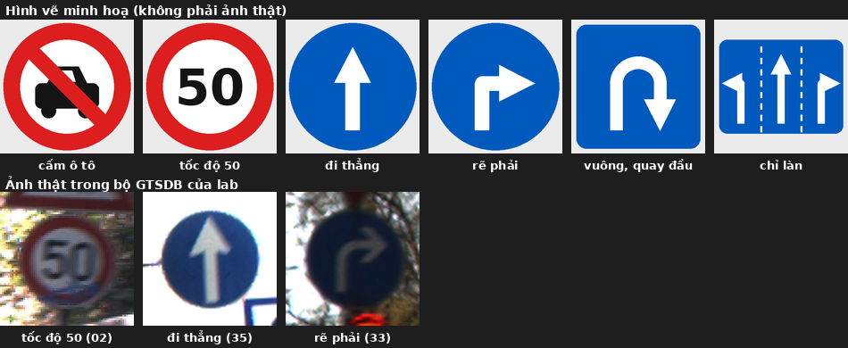

*Hàng trên là **hình vẽ minh hoạ** (vẽ lại theo bộ hình mẫu gửi trong nhóm, không phải ảnh thật). Hàng dưới là ảnh
thật lấy từ bộ GTSDB của lab (`GTS19`, `GTS24`, `GTS02`, cắt theo box của GT tham chiếu).*

**Chỗ hai tiêu chí cho kết quả khác nhau:**

| Biển | Theo V1.2 (hình dạng) | Theo [H] (ý nghĩa) | Trong 43 lớp GTSDB? |
|---|---|---|---|
| Cấm ô tô (tròn viền đỏ) | `prohibitory` | `prohibitory` ("cấm …") | **không** (chỉ có 15 *no vehicles*, 16 *no trucks*) |
| Tốc độ 50, đi thẳng, rẽ phải | rõ | rõ | có (02, 35, 33) |
| Vuông xanh, mũi tên quay đầu | không tròn → **không** phải `mandatory` → `other`? | chỉ hướng được đi → `mandatory`? | không |
| Chữ nhật xanh, mũi tên theo làn | như trên | như trên | không |

Tên lớp đối chiếu với `mini-task/data/traffic_sign/schema.json`: trong 43 lớp không có lớp nào là "cấm ô tô", "quay
đầu" hay "mũi tên theo làn".

**Đề xuất cho v2:**

1. Chọn **một** tiêu chí (hình dạng hoặc ý nghĩa) và ghi rõ.
2. Mỗi nhóm biển có ít nhất 1 ảnh thật (ví dụ tốt) và 1 ảnh dễ nhầm, đặt vào `sample_images/`. Ảnh thật đã có sẵn
   trong bộ GTSDB của lab, như hàng dưới của hình trên.
3. Biển vuông / chữ nhật xanh có mũi tên: ghi thẳng vào nhóm nào. Nếu phạm vi chỉ gồm 43 lớp GTSDB thì chúng nằm
   ngoài phạm vi (xem G-02).

## G-04 · `sign_class` tự gõ, hai bản dùng hai kiểu tên — **critical**

**Nguyên văn:**

- V1.2, mục 4: `speed_limit_20`, `no_overtaking`, `priority_next_intersection`… (snake_case).
- [H], mục 3: `Nhập mã hoặc tên chuẩn của biển báo (VD: speed limit 50, no entry, stop...)` (có dấu cách, và "mã hoặc
  tên" đều được).

**Vì sao critical:** `cvat_parser.py`, Rule 3, so `sign_class` bằng phép so khớp tuyệt đối (`user_sc != gt_sc`, chỉ bỏ
khoảng trắng ở hai đầu). Vì vậy:

- `speed limit 50` và `speed_limit_50` bị tính là **khác nhau**.
- Mã `02` và tên `speed limit 50` cũng bị tính là khác nhau.

Người gán làm đúng theo ví dụ của [H] vẫn FAIL nếu GT viết theo V1.2.

**Dẫn chứng:** trong bài NguyenHuuDung, cả 12 box đều để trống `sign_class`, nên chưa thấy lệch kiểu tên trong dữ liệu
thật. Mức critical ở đây dựa trên cách script so sánh, không dựa trên số lỗi đã gặp.

**Đề xuất:** đổi `sign_class` trên CVAT thành **select** với danh sách cố định (43 lớp, cộng `unknown`, cộng các lớp
ngoài GTSDB nếu chọn phạm vi [H]). Không làm được thì ít nhất chốt **một** quy ước viết và chuẩn hoá chữ trước khi so.
(`members/phong/cvat_eval` đã chuẩn hoá hoa/thường, khoảng trắng, gạch ngang, gạch dưới. Không nhận được từ đồng
nghĩa hay mã số.)

## G-16 · Giá trị mặc định tạo lỗi im lặng — **major**

**Nguyên văn:** [H] `readable (Lựa chọn - Mặc định: yes)`. V1.2 `Bắt buộc chọn 1 trong 3. Không để trống.`

**Vì sao khó:** giá trị mặc định là `yes`, nên không phân biệt được "đã xem và chọn yes" với "quên chọn". CVAT cũng tự
gán label đầu tiên cho box mới.

**Dẫn chứng:** bài NguyenHuuDung có cả 12/12 box `readable = yes` và 12/12 box label `prohibitory`, kể cả 2 biển STOP,
biển nhường đường và biển đường ưu tiên (4 box này theo cả V1.2 lẫn [H] đều là `other`). Từ file export **không biết
được** người gán đã chủ động chọn hay để mặc định. Đó chính là lý do đây là "lỗi im lặng".

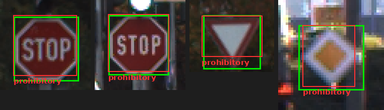

*Từ trái sang: STOP trái và STOP giữa (`00177`), nhường đường (`00177`), đường ưu tiên (`00054`). Box người gán (đỏ)
khớp vị trí GT (xanh), nhưng label là `prohibitory`. Theo cả V1.2 lẫn [H], cả bốn biển đều là `other`.*

**Đề xuất:** trong labels JSON của CVAT, để `__undefined__` đứng đầu danh sách và làm mặc định cho `readable` (và
`sign_class` nếu chuyển sang select). Checklist thêm câu: "đã đổi label của từng box khỏi mặc định chưa".

## G-07 · `readable`: `no` và `uncertain` — **major** (một phần)

**Nguyên văn:**

- [H]: `yes: Nhìn rõ nội dung/ký hiệu/con số` · `no / uncertain: Biển bị quá mờ, nhòe, quá xa hoặc vỡ nét…` (hai giá
  trị chung một mô tả).
- V1.2: 3 giá trị, không định nghĩa. Mục 5.4 lại ghi "không đọc được nội dung → `uncertain`".

**Còn thiếu:**

1. Khi nào chọn `no`, khi nào chọn `uncertain`?
2. Khi `readable` khác `yes` thì `sign_class` ghi gì? V1.2 ghi `unknown`, [H] không nói.
3. Label (nhóm biển) chọn theo hình dạng và màu được không?

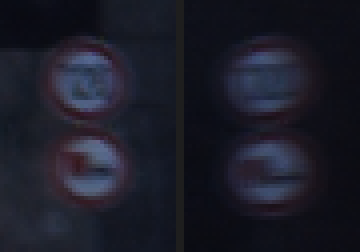

*`00366`, cặp biển trái (x 508–552) và phải (x 980–1024), phóng to điểm ảnh gốc. Trên cặp phải, mình **không đọc được
chữ số**; trên cặp trái chỉ nhận ra lờ mờ. Theo GT tham chiếu, biển trên là *tốc độ 120*, biển dưới là *cấm xe tải
vượt*. Bài NguyenHuuDung chọn `readable = yes` cho cả 4 biển. Đây đúng là tình huống cần phân biệt rõ
`yes` / `uncertain` / `no`.*

**Đề xuất:** [H] đã định nghĩa `yes`, chỉ cần tách thêm:

- `uncertain`: thấy rõ hình dạng và màu nhưng không chắc nội dung → vẫn chọn nhóm biển, `sign_class = unknown`.
- `no`: không nhận ra cả nhóm biển.

Hoặc bỏ hẳn một trong hai giá trị.

## G-05 · Box khi bị che — **major**

**Nguyên văn:**

- V1.2, mục 5.4: `Biển bị che < 50%: Vẽ box bao trọn (kể cả phần bị che)`.
- V1.2, mục 5.5 (bị cắt mép): `không ước lượng phần ngoài`.
- `guideline/sample_images/README.md` coi "chỉ vẽ phần nhìn thấy" là **sai**.
- [H]: chỉ định nghĩa checkbox `occluded`, không nói box vẽ tới đâu.

**Vì sao khó:**

1. Bị che thì phải ước lượng phần khuất, bị cắt mép thì không được ước lượng, mà không nêu lý do.
2. % che khuất chưa có cách đo.
3. [H] im lặng về chuyện này, nên người chỉ đọc [H] sẽ tự chọn cách vẽ.

**Dẫn chứng trong dữ liệu:** đã soi cả 3 ảnh, **không có** biển nào bị vật khác che rõ ràng, nên issue này không có
ảnh minh hoạ. Issue này dựa trên
câu chữ. Nếu chọn đây làm edge case cho v2 thì cần thêm ảnh có biển bị che.

**Đề xuất:** chốt một quy ước dùng chung cho cả bị che và bị cắt mép, ghi vào bản chính thức, và kèm một ảnh ví dụ.

## G-06 · Ngưỡng kích thước tối thiểu — **major**

**Nguyên văn:** V1.2 `Box < 15 × 15 pixel → Bỏ qua`. [H] không có ngưỡng.

**Vì sao khó:** V1.2 không nói là cả hai cạnh hay một cạnh < 15 px, cũng không nói đo trên ảnh gốc hay ảnh đã zoom.
[H] không có ngưỡng nào, nên không rõ biển rất nhỏ có phải vẽ không.

**Dẫn chứng:** biển nhỏ nhất trong 3 ảnh là *keep right* ở `00177`, box 18×18 trong GT tham chiếu. Bài NguyenHuuDung
không vẽ biển này, cũng không vẽ biển *keep right* 21×21 ở `00054`. Từ file không biết được đó là cố ý bỏ qua hay bị
sót.

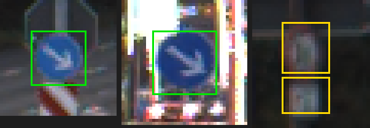

*Từ trái sang:*

1. *`00177` keep right 18×18: có GT, người gán không vẽ.*
2. *`00054` keep right 21×21: có GT, người gán không vẽ.*
3. *Phát hiện thêm khi soi ảnh: `00177` có một biển tròn viền đỏ **khoảng 10×13 px** kèm biển phụ (vùng 188–201,
   421–446). **GT tham chiếu không có** box này. Theo V1.2 thì biển này dưới 15 px nên bỏ qua; theo [H] thì không có
   ngưỡng nào nói phải bỏ.*

**Đề xuất:** "bỏ qua nếu **cạnh ngắn** < 15 px, đo ở zoom 100%", và ghi vào bản chính thức.

## G-09 · Không có đường escalate — **major**

Cả V1.2 ("Nếu nghi ngờ → đọc lại guideline") lẫn [H] đều không có cách đánh dấu "không chắc". Đề xuất: thêm checkbox
`needs_review`. QA quy định box có `needs_review` thì đưa vào danh sách edge case cho v2, không tính là lỗi.

## G-03 · Biển phụ: `sign_class` ghi gì — **major** (hạ từ critical)

**Hiện trạng:** V1.2 (mục 5.1: "Biển phụ gán nhãn `other`") và [H] (`other: … biển phụ`) **khớp nhau** về label. Cái
còn thiếu là `sign_class` của biển phụ, trong khi cả hai bản đều bắt buộc điền.

**Dẫn chứng:** `00054` có một biển phụ ngay dưới biển *tốc độ 20* (khoảng 1118–1147, 504–518). GT tham chiếu GTSDB
không có box này. Bài NguyenHuuDung cũng không vẽ.

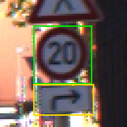

*`00054`: biển phụ **mũi tên rẽ phải** (vàng) ngay dưới biển *tốc độ 20*. GT tham chiếu có box cho biển 20 và tam giác
phía trên (xanh), không có box cho biển phụ.*

**Đề xuất:** thêm một giá trị, ví dụ `supplementary_panel`, và đảm bảo golden set có box biển phụ.

## G-08 · `relevant_to_ego` — **minor** (hạ từ major)

[H] đã có tiêu chí: "Bật nếu biển có hiệu lực trực tiếp với hướng đi/làn của xe chủ. Để trống nếu làn ngược lại hoặc
đường rẽ nhánh khác."

Còn thiếu: khi một ảnh không cho biết xe sẽ đi hướng nào thì làm gì. Ví dụ `00177` có 2 biển STOP ở hai vị trí khác
nhau và 1 biển nhường đường. Checkbox chỉ có bật/tắt, nên "không xác định được" và "không liên quan" trông giống hệt
nhau.

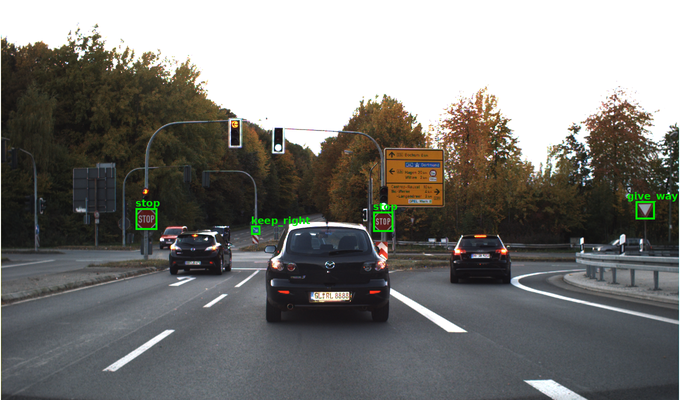

*`00177` (thu nhỏ ½): 2 biển STOP ở hai vị trí khác nhau, 1 biển nhường đường ở bên phải. Từ một ảnh không biết xe sẽ
đi hướng nào.*

Đề xuất: ghi rõ "không xác định được → để trống". Không chấm attribute này, vì V1.2 cũng không liệt kê nó trong Rule 3
của `cvat_parser.py`.

## G-10 · Box "sát", và box GT GTSDB không khít — **major** (phần guideline đã rõ)

[H]: "Vẽ khít sát viền ngoài của mặt biển báo. Không bao gồm cột, thanh đỡ hoặc bóng đổ." Như vậy phần guideline đã rõ.

Phần còn lại thuộc về **script QA** và **golden set**, không phải guideline:

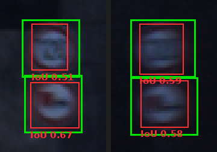

*`00366`: box GT tham chiếu (xanh) **rộng hơn mặt biển** vài px ở cả 4 biển. Box người gán (đỏ) ôm khít mặt biển,
đúng như [H] yêu cầu. IoU giữa hai box chỉ 0.51–0.67. Tức là dùng box GTSDB làm golden set sẽ phạt người vẽ đúng
guideline. **Golden set phải được vẽ lại theo quy ước "khít sát" của guideline.***

 `cvat_parser.py` dùng `IOU_THRESHOLD = 0.7`. Trong bài
NguyenHuuDung, 4 biển 24–28 px ở `00366` có IoU với GT tham chiếu chỉ 0.51–0.67. Tính tay: box 18×18 lệch 2 px theo cả
hai chiều cho IoU = 16·16 / (2·324 − 256) = 0.65. Card 03 của lab dùng IoU ≥ 0.6. Đề xuất nhóm cân nhắc ngưỡng theo
kích thước biển.

## G-11 · Quá tối / mờ: có gán hay không? — **major** (nâng từ minor, theo feedback)

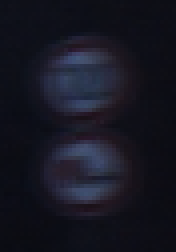

*`00366`, cặp biển bên phải (vùng 980–1024, 542–605), phóng to điểm ảnh gốc. Chỉ thấy hai hình tròn. Không đọc được
nội dung, gần như không thấy màu viền.*

**Câu hỏi guideline chưa trả lời:** với biển mờ tới mức này, **có vẽ box không**, chứ không chỉ là chọn `readable`
nào.

- V1.2 có ngưỡng bỏ qua theo kích thước (< 15 px) và theo mức bị che (> 70%), nhưng **không có** ngưỡng theo độ
  rõ. Biển này 24–28 px, nên theo V1.2 vẫn phải vẽ.
- [H] ghi "`no / uncertain`: biển bị quá mờ, nhòe…", tức là có vẽ box rồi chọn `readable`. Nhưng [H] không nói khi
  nào mờ quá thì **bỏ hẳn**.
- GT tham chiếu GTSDB **có** gán cặp biển này (tốc độ 120 và cấm xe tải vượt). Bài NguyenHuuDung cũng vẽ, với
  `readable = yes`.

**Đề xuất:** thêm vào v2 một quy tắc bằng tiêu chí nhìn thấy được. Ví dụ: *"Vẫn vẽ box nếu nhận ra đó là mặt biển (thấy
được hình dạng). Không nhận ra được nhóm biển thì `readable = no`, `sign_class = unknown`, bật `needs_review` (G-09).
Không chỉnh sáng rồi đoán nội dung."* Kèm ảnh này làm ví dụ.

## G-12 · Danh sách loại trừ — **minor**

V1.2, mục 5.3 có danh sách, còn [H] không có. Những chỗ còn mơ hồ trong V1.2 (**cần nhóm quyết**):

- Biển điện tử / LED có gán không? Lý do?
- "Hỏng > 70%" đo thế nào? Có tính phai màu, bẩn không?
- Biển xoay nghiêng hoặc nhìn từ cạnh thì sao?

Khi soi ảnh `00177` có thêm các vật thể mà hai bản guideline đều chưa nói rõ:

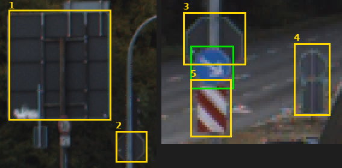

1. Tấm chữ nhật lớn màu xám có khung (trông như mặt sau của biển chỉ dẫn).
2. Viền hình biển (bát giác hoặc tròn) màu xám, không có mặt biển.
3. **Mặt sau biển STOP** (hình bát giác xám) ngay phía trên biển *keep right*. Hình dạng giống STOP, nên dễ bị nhầm là
   biển.
4. Mặt sau một biển trên cột, bên phải.
5. **Cọc tiêu sọc đỏ trắng** ngay dưới *keep right*. Ở `00177` còn một cọc tương tự dưới biển STOP giữa.

V1.2 loại trừ "mặt sau của biển báo" (1–4) nhưng không có ảnh ví dụ. [H] không có danh sách loại trừ. Cọc tiêu (5) thì
không bản nào nhắc tới. Đề xuất: thêm ảnh này vào `sample_images/` làm ví dụ loại trừ trong v2.

## G-13 · `danger` "nền vàng" — **minor**

Chỉ có ở V1.2 (mục 2). Biển *đi bộ qua đường* ở `00054` là tam giác viền đỏ nền trắng (xem ảnh ở G-01). [H] không mô tả màu nên không
bị lỗi này.

## G-14 · Ảnh không có biển — **minor**

Cả hai bản đều chưa nói. 3 ảnh hiện tại đều có biển. Bộ 28 ảnh GTSDB của lab có 2 ảnh không có biển (`00108`,
`00139`), nên nếu golden set dùng tới thì cần thêm một câu: "không vẽ gì, vẫn Save".

## G-15 · Phiên bản — **minor**, gộp vào G-18

---

## Đối chiếu với bài gán thật (NguyenHuuDung)

Chấm bằng `members/phong/cvat_eval/evaluate.py`, GT là `data/ground_truth/gt_gtsdb_raw.json`. Đây là **GT tham chiếu
GTSDB, chưa phải golden set của nhóm**. Kết quả: 8/12 biển khớp vị trí, precision 66.7%, recall 66.7%.

Diễn giải đúng phụ thuộc vào bản guideline được chọn (G-18):

| Quan sát | Nếu theo V1.2 / GTSDB | Nếu theo [H] |
|---|---|---|
| Vẽ 4 biển chỉ dẫn / thông tin (G-02) | box thừa | **đúng phạm vi**, nhưng label phải là `other` (bài ghi `prohibitory`) |
| 4 biển STOP / nhường đường / đường ưu tiên → `prohibitory` | sai label | sai label (hai bản giống nhau) |
| `sign_class` trống cả 12 box | thiếu attribute bắt buộc | thiếu attribute bắt buộc |
| `readable = yes` cả 12 box | không phân biệt được với mặc định (G-16) | như bên trái |
| Không vẽ 4 biển (18–40 px) | thiếu | thiếu ([H] không có ngưỡng bỏ qua) |
| IoU 0.51–0.67 trên biển 24–28 px | dưới ngưỡng 0.7 của script | như bên trái |

Mình không kết luận về người gán: từ file export không biết bài đã làm xong hay chưa, và dùng bản guideline nào. Cần
chạy lại sau khi nhóm chốt golden set.

## Ưu tiên cho v2 (theo quy trình thầy yêu cầu)

1. **G-18 → G-17 → G-04**: chốt một bản, thống nhất cách xếp *no entry*, thống nhất cách viết `sign_class`. Chưa làm
   xong 3 việc này thì kết quả chấm không đáng tin.
2. **G-02, G-01**: chọn phạm vi, sửa bảng mã (nếu giữ bảng), rồi làm golden set đúng theo phạm vi đó.
3. **G-19, G-20, G-11**: thêm mục "biển chỉ dẫn", bảng ảnh mẫu cho từng nhóm, quy tắc cho biển quá mờ. Đây là phần
   "thêm edge case, thêm example" của v2.
4. **G-16, G-07, G-06, G-09**: sửa schema CVAT (mặc định `__undefined__`, select) và thêm định nghĩa. Đây cũng là phần
   "môi trường hạn chế rủi ro nhầm nhãn" mà thầy yêu cầu.
5. Các issue minor: thêm vào v2 dưới dạng edge case kèm ảnh ví dụ.

Khi sửa xong một issue, đổi cột **Trạng thái** thành `fixed (vX)` và ghi số issue vào lịch sử thay đổi của guideline.
